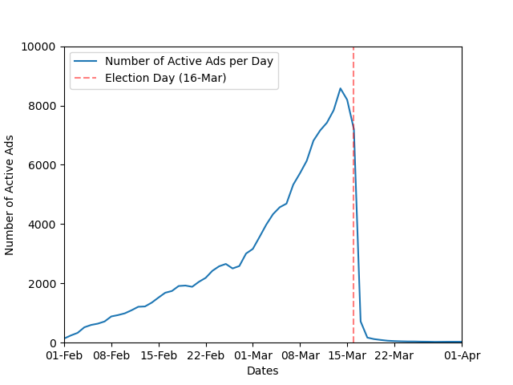
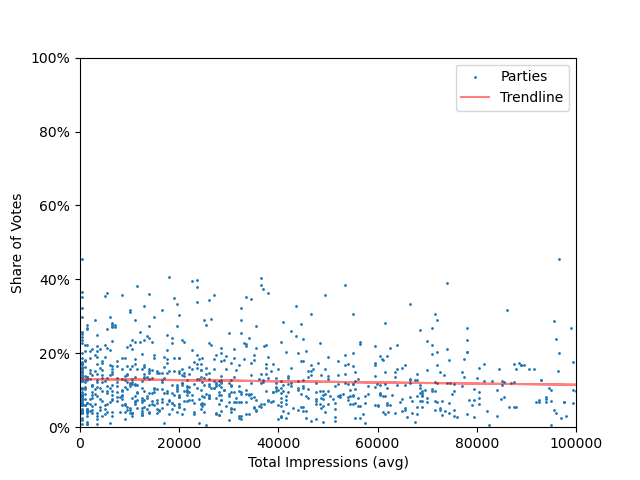
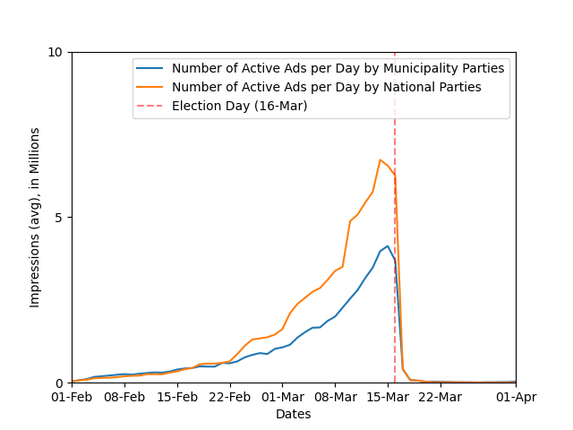

# Do Political Facebook ads result in votes? A short analysis of the Facebook ad campaigns during the 2022 Dutch local elections
<!-- Date range -->
<!-- Interesting dataset: many parties, very localized impressions -->
<!-- Caveat about automatic data -->
<!-- microtargeting -->

A few months ago, the Netherlands held local elections (on the 16th of march). In these elections, the city council of each municipality is elected.

This is a great opportunity to do some data analysis on election data. Local elections are an interesting dataset, because there are many parties (I count 2836 different parties) trying to reach very specific voters (i.e. people living in their municipality). This is unlike a national election, where a handful of parties are trying to reach virtually every breathing adult in the country.

We combined (publicly available) [election data about the local elections](https://data.overheid.nl/dataset/verkiezingsuitslagen-gemeenteraad-2022) with (publicly available) data from Facebook to be able to analyze the Facebook advertisement campaigns run by political parties during the Dutch local elections in 2022.

This data allows us to make graphs like Figure 0, which shows the ramp up of political ads in the weeks leading up to the election date and the immediate stop of the ad campaigns after

**Figure 0**: Number of Ads per Day from 1 Feb 2022 to 1 Apr 2022.

## Background on the Facebook Ad Library

In 2019, Facebook released the [Facebook Ad Library](https://www.facebook.com/ads/library/), a public repository of all (political) ads run on their platforms (i.e. Facebook and Instagram). This repository provides the content of each, as well as metadata about the ad (e.g. who ran the ad, who paid for the ad, how many times the ad was shown, how long the ad is/was active etc.). This allows for a lot of interesting research into microtargeting by political campaigns, because it is now possible for anyone to see all ads run by political campaigns. For example, [an online dashboard that I maintain](https://joren485.github.io/DutchPoliticalFacebookAdComparision/) that aggregates and tracks statistics about ads run by Dutch political parties.

An important piece of metadata that the Facebook Ad Library provides on each ad is (an estimation[^0] of) the number of [*Impressions*](https://www.facebook.com/business/help/675615482516035) that an ad got. We can think of impressions as the number of times that an ad was shown to a user.

### Are Ads Correlated with Votes?

The first question I wanted to answer is whether having a higher number of impressions means a higher number votes. In other words, are ads correlated with impressions?

Figure 1 tries to answer this question. Every dot represents a party, with the sum of their impressions on the x-axis and the percentage of votes (i.e. the number of votes for a party divided by the number of valid votes in the municipality of the party) they got on the y-axis.
<!-- Figure 1 does not show all data -->

**Figure 1**: ???

As we can see, there seems to be little to no correlation.

This is a bit surprising, as I expected there to be a slight correlation, as I assume that parties which are more popular have more resources (to buy Facebook ads).

### Do Parties that run Facebook Ads get more votes?

How do parties that do not run Facebook ads fair against parties that do run Facebook ads?

We get a similar conclusion as above from the average vote share:

* Parties that run Facebook ads have an average share of votes of 12.35%.
* Parties that do *not* run Facebook ads have an average share of votes of 11.18%.

There seems to be a negligible difference in votes

### Why Pay for Facebook Ads, if They do not seem to Result in Extra Votes?

Why run (and pay for) Facebook ads if they seem to have little effect on the votes.? After all, the goal of a political party during an election is to get as many votes as possible.

There are, of course, more reasons to run Facebook ads than just trying to get voters. Brand Awareness, for example. Every party will somehow have to tell eligible voters who they are and what they stand for. Some parties choose to do this by giving out flyers, others by running Facebook ads.

A more pessimistic perspective on this question is that parties do not test the effectiveness of their ads and run ads because others do it too.

We can show that this last point is at least partially true. For example, [this ad](https://www.facebook.com/ads/library/?id=661407301656722) by [GroenLinks in Aa en Hunze](https://aaenhunze.groenlinks.nl/) (a municipality in Drenthe) was shown to approximately 97.65% people that are not in Drenthe. Or [this ad](https://www.facebook.com/ads/library/?id=656135622396834) by [Volt Arnhem/Nijmegen](https://arnhemnijmegen.volteuropa.org/) was only shown to people that are in Noord-Brabant and not in Gelderland (the province of Arnhem and Nijmegen). Luckily, these ads cost less than €100, but I can only assume they got zero value out of it. These are extreme examples and definitely not all ads/ad campaigns are like this, but it does show that some (local) parties are not thinking correctly about the audience of their ad campaigns.

### Do Local or National Parties Advertise more?

There are two types of local parties that participate in a local election: local branches of a national party (we refer to as *branch parties*) and parties that are specific to one municipality (we will refer to as *municipality parties*)[^1]. We count 1234 branch parties and 1602 municipality parties.

Branch parties generally have more resources to their disposal than municipality parties, because branch parties are part of a larger infrastructure that is able to support them (e.g. financially, but also by organizing training sessions). Because of this, municipality parties have a bit of a stigma of being less professional than branch parties.

I cannot comment on this stigma in general terms. But I can show you a graph that compares data between branch parties and municipality parties. For example, Figure 2 shows the number of daily impressions that branch parties collectively got versus those of municipality parties.

Branch parties are clearly getting more impressions than municipality parties. However, municipality parties are following the same trends. The municipality parties that run Facebook ads seem to

560 branch parties run ads
1022 municipality parties run ads.

**Figure 2**: ???

### Conclusion
<!-- no correlation -->
So, what have we learned by this?

First, the Facebook Ad Library allows anyone to crunch some (in my opinion) interesting data. This includes parties themselves. They can get a good understanding of the advertisement campaigns of the competition.

Parties do not seem to get a significant edge over other parties by using the dark magic of microtargeting. This might be because microtargeting is not as powerful as many people think or because the parties are just getting started. Only time will tell.

If you are interested in this kind of data, check out [this dashboard](https://joren485.github.io/DutchPoliticalFacebookAdComparision/) I created that tracks data and statistics about the Facebook ads of Dutch national parties.

[^0]: The Ad Library does not provide exact numbers, but ranges. For example, it does not tell us that an ad cost €2543,21, but that the ad cost between €2000,- and €3000,-.

[^1]: There are also local parties that are not branches of national parties but are affiliated with a national party and parties that are affiliated with parties from other municipalities but not with any national party. For simplicity's sake, we just consider two types of parties: branch parties and municipality parties.
